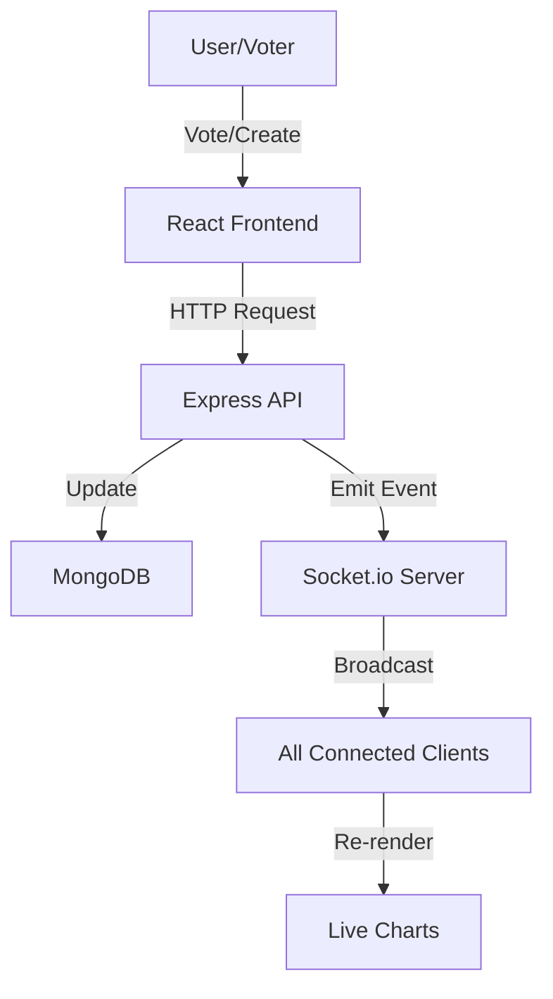

# Project Report: Opinio 🗳️
## The New Standard for Gathering Opinions

---

### **1. Title Page**

**Project Name:** Opinio  
**Subtitle:** A Modern Real-Time Polling Application  
**Developer:** Shubh  
**Domain:** Full-Stack Web Development  
**Date:** May 16, 2026  
**Technologies:** React, Node.js, Express, MongoDB, Socket.io  
**Status:** Version 1.0 (Live Deployment)

---

### **2. Abstract**

Opinio is a high-performance, real-time polling application designed to streamline the process of gathering and analyzing public opinion. In an era where instant feedback is critical, Opinio provides a seamless interface for creating, sharing, and monitoring polls. By leveraging modern web technologies such as WebSocket (Socket.io) for live updates and a robust MERN stack architecture, the platform ensures that data is not only accurate but also delivered instantaneously to all participants. This report details the architectural decisions, design philosophy, and implementation strategies that make Opinio a premium tool for feedback collection.

---

### **3. Introduction**

#### **3.1 Background**
In the digital age, the ability to capture collective sentiment quickly and efficiently is invaluable. Whether it's for product development, team decision-making, or community engagement, the "voice of the user" is the most powerful asset a creator has. However, traditional feedback methods are often slow, cumbersome, and lack the engagement necessary to drive high participation rates.

#### **3.2 Motivation**
The motivation behind Opinio was to bridge the gap between simplicity and power. Most existing polling tools are either buried within complex survey suites or lack the modern "live" feel that today's users expect. Opinio was built to feel like a "live conversation"—where results grow and shift as people participate, creating a sense of urgency and community.

---

### **4. Project Objectives**

The primary objectives of the Opinio project were:
1.  **Instantaneous Interaction:** Achieve sub-second latency for poll result updates across all connected clients using WebSockets.
2.  **User-Centric Design:** Implement a "premium" aesthetic using a custom design system that prioritizes clarity and modern visual cues.
3.  **Scalable Architecture:** Design a backend capable of handling high-concurrency voting events without degradation in performance.
4.  **Security & Integrity:** Implement multi-layered validation (JWT for creators, IP/UserID tracking for voters) to ensure data integrity.
5.  **Cross-Platform Accessibility:** Ensure the application is fully responsive, maintaining its aesthetic and functional integrity from mobile phones to 4K displays.

---

### **5. Technology Stack**

The application is built using a modern, decoupled architecture, separating the concerns of presentation, logic, and data persistence.

#### **5.1 Frontend (The Client)**
-   **React 18 (Vite):** Utilized for its superior developer experience and efficient Virtual DOM rendering.
-   **TanStack Router:** Provides a robust, type-safe routing solution that handles deep linking and state-aware navigation seamlessly.
-   **Zustand:** A minimalist state management solution that handles the global application state (Auth tokens, Poll cache) with higher performance than traditional Redux.
-   **Vanilla CSS:** A deliberate choice to build a custom design system from scratch, ensuring a unique brand identity and minimal bundle size.
-   **Lucide React:** For a consistent and modern iconography set.

#### **5.2 Backend (The Server)**
-   **Node.js & Express.js:** The core runtime and framework for the RESTful API, chosen for its asynchronous nature and vast ecosystem.
-   **Socket.io:** The engine for real-time bi-directional communication.
-   **Mongoose:** An ODM for MongoDB that provides schema-based solutions for application data.
-   **JWT (JSON Web Tokens):** For stateless, secure user sessions.
-   **Bcrypt:** For military-grade password hashing.

#### **5.3 Infrastructure**
-   **MongoDB Atlas:** Distributed cloud database.
-   **Vercel:** Optimized frontend hosting.
-   **Render:** High-performance backend hosting with auto-scaling capabilities.

---

### **6. System Architecture**

#### **6.1 Logic Flow Diagram**



#### **6.2 The Real-time Engine**
Opinio uses "Socket Rooms" to manage communication. When a user navigates to `opinio.com/poll/123`, the frontend joins a virtual room named `poll-123`. When any user votes on that poll, the server emits a message *only* to room `poll-123`. This architecture prevents "noise" on the network and ensures that the application can scale to thousands of concurrent polls without cross-talk.

---

### **7. Key Features & Functionalities**

-   **Instant Poll Creation:** A frictionless form that allows adding multiple options, setting privacy levels, and generating a link in under 10 seconds.
-   **Personalized Dashboard:** Authenticated users have access to a management console where they can track "Total Votes," "Participation Rate," and "Live Status" of their polls.
-   **Smart Link Distribution:** Automated generation of short-links for social media platforms.
-   **Live Data Visualization:** Dynamic bar and pie charts that use smooth transitions to reflect new votes.
-   **Security Settings:** Creators can toggle between "Anyone can vote" and "Login required," allowing for flexibility between viral reach and data strictness.

---

### **8. Implementation Details**

#### **8.1 Backend API Design**

| Endpoint | Method | Description | Auth Required |
| :--- | :--- | :--- | :--- |
| `/api/auth/register` | POST | Register new user | No |
| `/api/auth/login` | POST | Authenticate and return JWT | No |
| `/api/polls` | POST | Create a new poll | Yes |
| `/api/polls/:id` | GET | Fetch poll details | No |
| `/api/responses` | POST | Cast a vote | Optional |
| `/api/polls/user` | GET | Fetch polls created by user | Yes |

#### **8.2 Database Schema (Mongoose)**
The `Poll` schema is the heart of the application:
```javascript
const PollSchema = new mongoose.Schema({
  question: String,
  options: [{ text: String, votes: { type: Number, default: 0 } }],
  creator: { type: Schema.Types.ObjectId, ref: 'User' },
  settings: { anonymous: Boolean },
  createdAt: { type: Date, default: Date.now }
});
```

---

### **9. UI/UX Design Philosophy**

The design of Opinio, codenamed "Warm Chocolate," focuses on comfort and premium aesthetics.

#### **9.1 Color Palette & Typography**
-   **Light Mode:** Cream backgrounds (`#fffdfa`) with dark chocolate text (`#3e2723`) and burnt orange accents (`#d2691e`).
-   **Dark Mode:** Deep espresso backgrounds (`#1c140f`) with vibrant orange highlights (`#f97316`).
-   **Typography:** The "Inter" font family was chosen for its geometric perfection and high readability at small sizes.

#### **9.2 Glassmorphism**
Poll cards and navigation bars use `backdrop-filter: blur(12px)`, creating a layered "glass" effect that gives the application a sense of depth and modernity.

---

### **10. Development Challenges & Solutions**

1.  **Challenge:** Handling race conditions during rapid voting.
    -   **Solution:** Implemented atomic updates in MongoDB using the `$inc` operator to ensure vote counts are never corrupted by simultaneous writes.
2.  **Challenge:** Preventing multiple votes from the same user on anonymous polls.
    -   **Solution:** Utilized a combination of LocalStorage flags and IP-hash tracking on the backend to provide a reasonable level of voting integrity for non-authenticated users.

---

### **11. Results & Conclusion**

Opinio successfully delivers on its promise of a "New Standard for Gathering Opinions." The integration of Socket.io has proven to be highly efficient, providing a truly live experience that generic survey tools lack. The custom design system has resulted in a unique visual identity that feels more like a premium product than a simple utility.

In conclusion, Opinio is a robust, full-stack solution that showcases the potential of modern web technologies to solve the age-old problem of efficient feedback collection.

---

### **12. Future Scope**

1.  **AI Analysis:** Automated sentiment analysis on poll questions to suggest optimal timing or phrasing.
2.  **Advanced Privacy:** Integration of Blockchain-based voting for high-stakes decisions requiring absolute transparency.
3.  **Collaborative Creation:** Allowing multiple users to edit and manage a single poll.
4.  **Embeddable Widgets:** A small JS snippet to allow Opinio polls to be embedded directly into third-party blogs and news sites.

---
**Prepared by: Shubh**  
**Project: Opinio**  
**End of Document**
